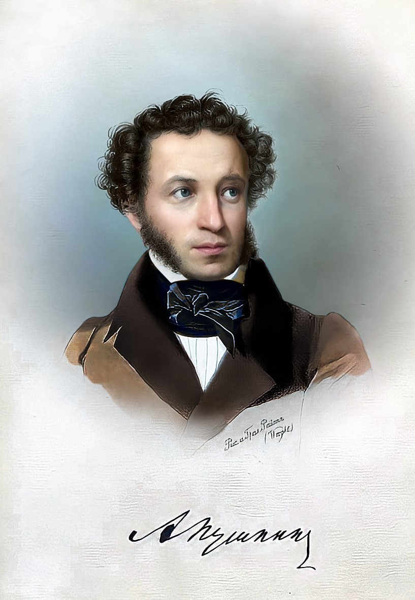

# Александр Сергеевич Пушкин

## Дата рождения:
6 июня 1799 г., Москва, Российская империя.

## Дата смерти:
10 февраля 1837 г. (37 лет), Санкт-Петербург, Российская империя.

## Род деятельности:
Поэт, драматург, прозаик.

## Наиболее значительные произведения:
«Руслан и Людмила», «Пиковая дама», «Сказка о царе Салтане», «Капитанская дочка».
Александр Пушкин – величайший русский классик, поэт, прозаик, публицист, драматург.

## Фотография
